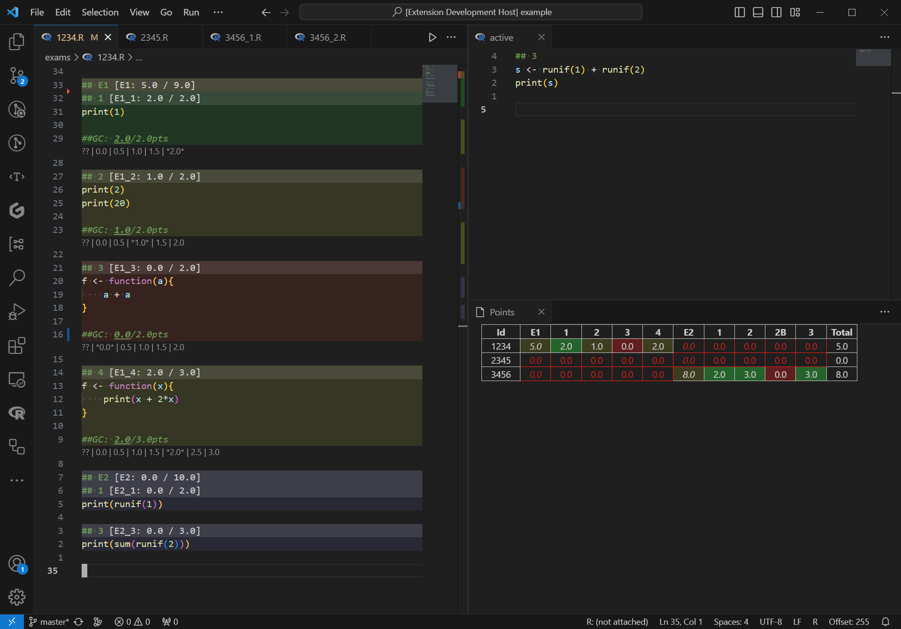

# Grading exams in vscode

This is a vscode extension that helps grading exams in vscode.

## Exam format
The target exam formats are programming exams where the students submit
plain text files (e.g. `.R` or `.py` files),
which are structured into several exercises:
```r
## Question 1
print('this is my solution to q1')

## Question 2
print('the solution to q2 is:')
print(123)
```
*(See `./example/` for a more detailed example.)*

The grader must be allowed to modify the files (or copies thereof)
in order to specify points and leave comments.
These comments will be in a human-readable format,
allowing people without this extension to understand the feedback.
Assigning points without this extension is also possible,
but inconvenient, since the points-comments must match the corresponding regular expressions.


## Features
The extension parses all exam files,
identifying answered exercises and parsing points given by the grader.
The body of exercises can be highlighted accordingly.
The command `vscode-grading.addPointsComments` adds placeholders for points comments.
Points can be adjusted directly in the editor, through code-lenses, or keyboard shortcuts
(e.g. `ctrl+k 2` for 2 points, `ctrl+k -` to decrement points).

An overview of the identified exercises and parsed points can be shown using commands
`vscode-grading.checkPresent`, `vscode-grading.checkGraded`, and `vscode-grading.checkPoints`
(`ctrl+click` a cell to go to the corresponding file).

The solution to the currently selected exercise (or any fixed one) can be shown
in a separate editor that updates when the selection changes,
using the command `vscode-grading.showSolution`.




## Configuration
The structure of the exam needs to be specified in the setting `"grading.exercises"`,
which should be done in the workspace settings.
The patterns used to identify exercises and 
patterns/templates to identify and modify (points) comments can be adjusted in the settings
`"grading.exercise.startRegex"`, `"grading.comment.regex"`,
`"grading.comment.template"`, `"grading.comment.pointsRegex"`,
and related ones.
For details, see the description of individual config entries
and the example configuration in `./example/.vscode/settings.json`.

Further configuration options include toggles for the background highlighting and code-lenses.

## Development
The extension was primarily written to match my personal use-case,
and is under (infrequent) development.
Any bug reports, feature suggestions, or pull requests are welcome!
